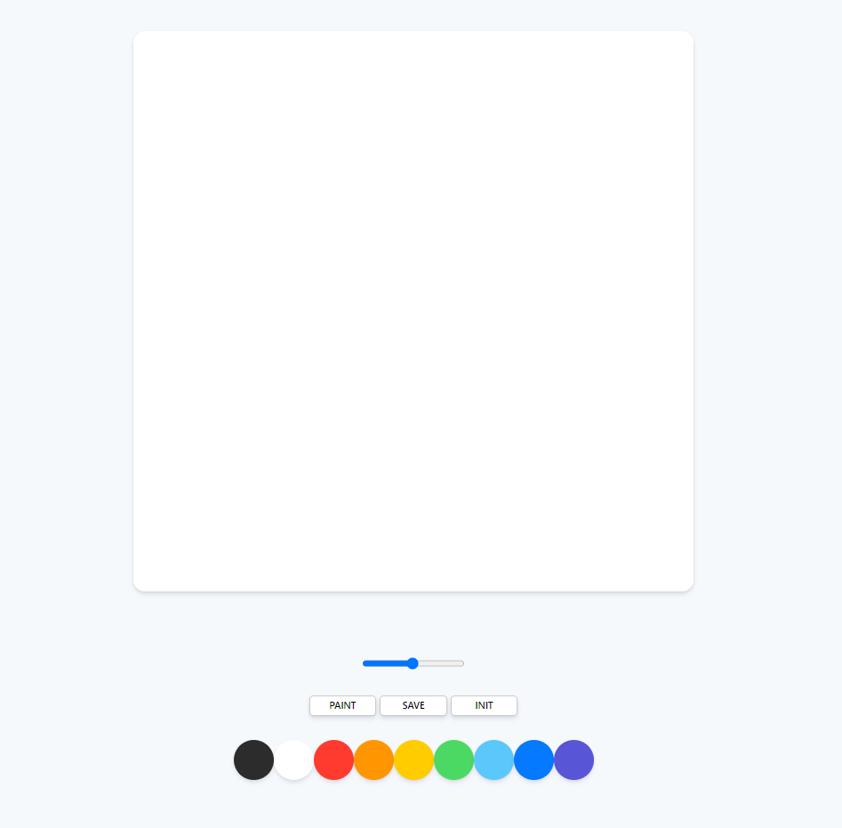
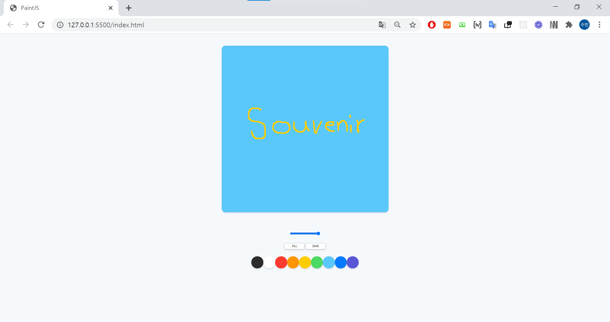

# paintjs
[Painting Board made with Vanilla JS](https://nomadcoders.co/javascript-for-beginners-2/lobby)

### 기능 요소

- 색칠 기능
  - Paint - 그림 그리기
    - 브러쉬 크기 조절 가능
  - Fill - 화면 채우기
- 저장 기능
  - Save 버튼을 통해 .png 파일로 저장 기능
- 초기화 기능
  - Init 버튼을 통해 화면 초기화 기능

### 첫 화면

### 그리기

### 🏆[Certificate](https://github.com/souvenir718/TIL/blob/master/Certificate/%EB%B0%94%EB%8B%90%EB%9D%BC%20JS%EB%A1%9C%20%EA%B7%B8%EB%A6%BC%ED%8C%90%20%EB%A7%8C%EB%93%A4%EA%B8%B0.pdf)
