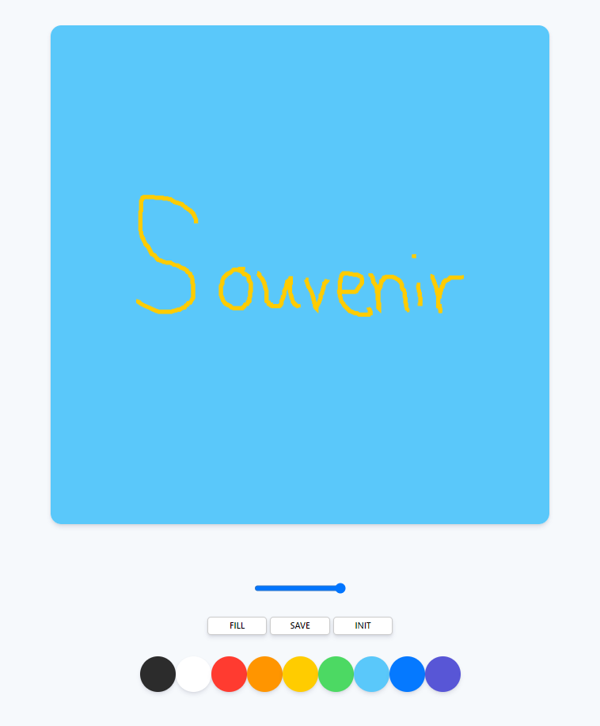

# paintjs
[Painting Board made with Vanilla JS](https://nomadcoders.co/javascript-for-beginners-2/lobby)

### #1 SETUP + STYLES

1.0 Project Setup

1.1 Styles part One

1.2 Styles part Two

### #2 PAINTJS

2.0 Canvas Events

2.1 2D Context

2.2 Recap!

2.3 Changing Color

2.4 Brush SIze

2.5 Filling Mode

2.6 Saving the Image

2.7 Conclusions

### 기능 요소

- 색칠 기능
  - Paint - 그림 그리기
    - 브러쉬 크기 조절 가능
  - Fill - 화면 채우기
- 저장 기능
  - Save 버튼을 통해 .png 파일로 저장 기능
- 초기화 기능
  - Init 버튼을 통해 화면 초기화 기능

### 첫 화면

### 그리기

